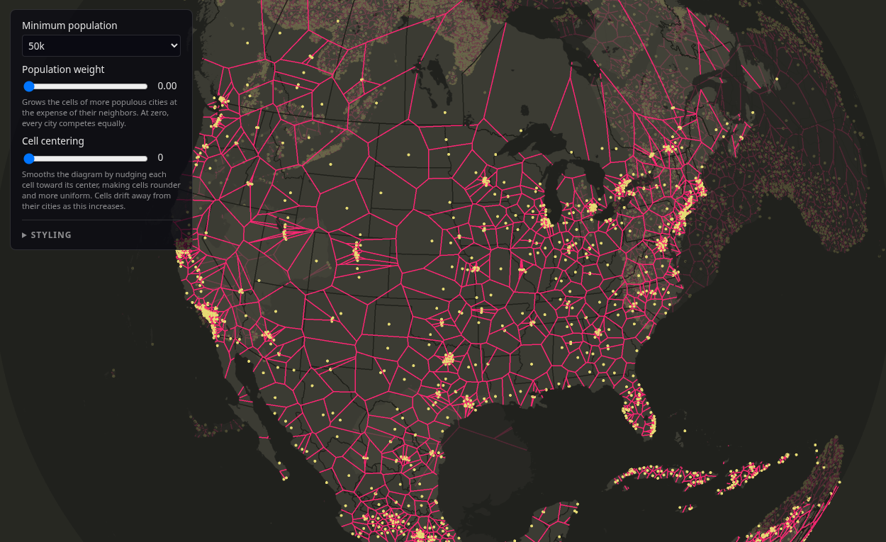

# Voronoi Village

An interactive WebGPU globe that carves the world into the hinterlands of its
cities. Every settlement claims the territory closer to it than to any other,
forming a spherical Voronoi diagram that updates in real time as you filter,
weight, and relax it.

**[Live demo](https://wwwtyro.github.io/voronoi-village/)**



## Controls

Drag to rotate the globe and scroll to zoom. Zooming in keeps the point under
the cursor anchored in place. Hovering a cell shows the city's name, region,
and population.

The overlay provides:

- **Minimum population**: which cities get a cell.
- **Population weight**: grows the cells of more populous cities at the
  expense of their neighbors, turning the diagram into a spherical power
  (Laguerre) diagram.
- **Cell centering**: Lloyd relaxation steps that round the cells out and
  make them more uniform.
- **Styling**: border visibility, line width, color themes, and per-color
  overrides.

## Running

```sh
npm install
npm run dev      # Vite dev server
npm run build    # type-check and bundle
```

Requires a browser with WebGPU support.

## How it works

The app is plain MVC. `src/model.ts` holds all state, `src/controller.ts`
maps input and overlay controls onto it, and `src/view/` renders it. The
heavy lifting runs on the GPU each frame:

- Voronoi cells (`view/voronoi.wgsl`) are computed meshlessly, after
  Ray et al. 2018. One compute thread per city starts from a spherical cap
  and clips it by the bisector plane of every nearby site, walking a spatial
  grid outward until no farther site can matter. Surviving edges feed an
  indirect instanced draw. The same pass handles power weights and Lloyd
  relaxation.
- The globe (`view/sphere.wgsl`) is an analytic sphere ray-traced from a
  cube proxy, shaded land or water by a signed-distance-field cubemap of the
  coastlines.
- Cities and borders render as instanced dots and polyline quads, and a blit
  pass downsamples for anti-aliasing.

## Data pipeline

The binaries in `public/data/` are baked by the scripts in `scripts/`. Each
is a standalone Node script that downloads its source data and writes a
compact little-endian binary:

| Script | Source | Output |
| --- | --- | --- |
| `build-cities.mjs` | GeoNames cities500 dump | `cities.bin` with coordinates, population, capital type, country, region, and name per city |
| `build-borders.mjs` | Natural Earth 1:10m boundary lines | `borders.bin` with country and state/province polylines |
| `build-land-sdf.mjs` | Natural Earth 1:10m land and lakes | `land-sdf.bin`, a signed distance field of land as a cubemap |

Run one with `node scripts/build-cities.mjs` and likewise for the others. The
outputs are committed, so this is only needed to refresh the source data.
